# Maternal Health Risk Prediction

## Introduction

Maternal Health is a critical aspect of public health, especially in developing countries where maternal mortality rates are high. Early prediction and intervention can significantly reduce the risks associated with pregnancy and childbirth. This project aims to predict the risk level of maternal health using machine learning algorithms based on various health indicators.

## Table of Contents

- [Maternal Health Risk Prediction](#maternal-health-risk-prediction)
  - [Introduction](#introduction)
  - [Table of Contents](#table-of-contents)
  - [Dataset](#dataset)
  - [Exploratory Data Analysis](#exploratory-data-analysis)
    - [Risk Level Distribution](#risk-level-distribution)
    - [Feature Analysis](#feature-analysis)
  - [Data Preprocessing](#data-preprocessing)
  - [Model Training Evaluation](#model-training-evaluation)
    - [Multinomial Logistic Regression](#multinomial-logistic-regression)
    - [Random Forest Classifier](#random-forest-classifier)
    - [XGBoost Classifier](#xgboost-classifier)
  - [Results](#results)
    - [Model Performance Comparison](#model-performance-comparison)
    - [Confusion Matrices](#confusion-matrices)
  - [Conclusion](#conclusion)
  - [Requirements](#requirements)
  - [References](#references)

## Dataset
The **Maternal Health Risk Dataset** came from the [UCI Machine Learning Repository](https://archive.ics.uci.edu/dataset/863/maternal+health+risk). It contains health data from pregnant women, with features that include:

| Variable Name | Role     | Type     | Demographic | Description                                                                             | Units  | Missing Values |
|---------------|----------|----------|-------------|-----------------------------------------------------------------------------------------|--------|----------------|
| Age           | Feature  | Integer  | Age         | Any ages in years when a woman is pregnant.                                              |        | no             |
| SystolicBP    | Feature  | Integer  |             | Upper value of Blood Pressure in mmHg, another significant attribute during pregnancy.    | mmHg   | no             |
| DiastolicBP   | Feature  | Integer  |             | Lower value of Blood Pressure in mmHg, another significant attribute during pregnancy.    | mmHg   | no             |
| BS            | Feature  | Integer  |             | Blood glucose levels in terms of a molar concentration.                                  | mmol/L | no             |
| BodyTemp      | Feature  | Integer  |             | Body temperature in degrees Fahrenheit (F).                                              | F      | no             |
| HeartRate     | Feature  | Integer  |             | A normal resting heart rate.                                                             | bpm    | no             |
| RiskLevel     | Target   | Categorical |         | Predicted Risk Intensity Level during pregnancy considering the previous attribute.       |        | no             |

## Exploratory Data Analysis

### Risk Level Distribution

- **Objective**: Understand the distribution of risk levels among patients.

    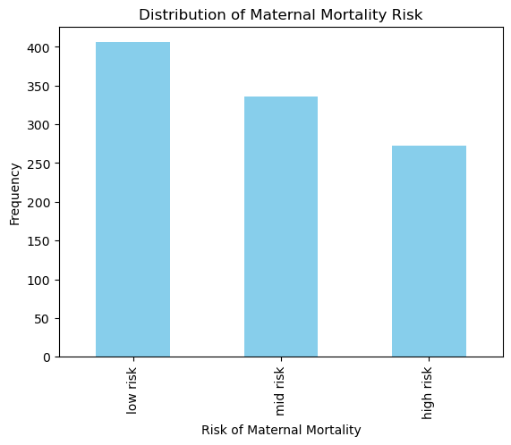

### Feature Analysis

- **Boxplots**:
- **Scatter Plots**:
- **Density Plots**:

    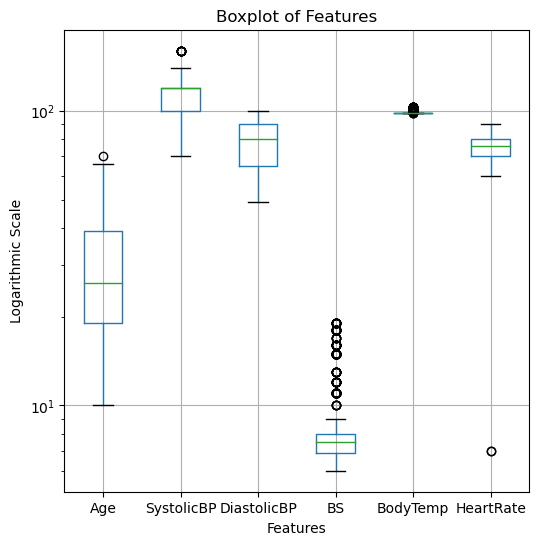

## Data Preprocessing

- **Label Encoding**: Converted categorical risk levels to numerical values ('low risk': 0, 'mid risk': 1, 'high risk': 2) for model compatibility.
- **Train-Test Split**: Split the dataset into training and testing sets(80% training, 20% testing). 
- **Feature Scaling**: Standardized features using 'StandardScaler' to improve model performance for algorithms sensitive to feature scaling.

## Model Training Evaluation

### Multinomial Logistic Regression

- **Training**: Used a multinomial logisitic regression model with L-BFGS solver and a maximum of 1000 iterations.
- **Feature Importance**: Identified 'BS' (Blood Sugar) as the most significant feature, while 'Age' was the least significant.
- **Accuracy**: Achieved an accuracy of **65.02%**.
- **Confusion Matrix and ROC Curve**: Evaluated model performance using confusion matrix and ROC curves for each class.

    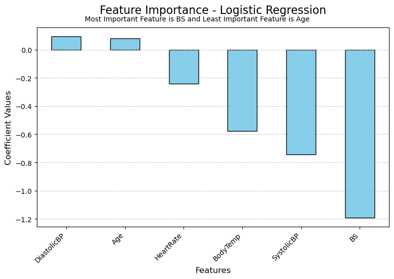
    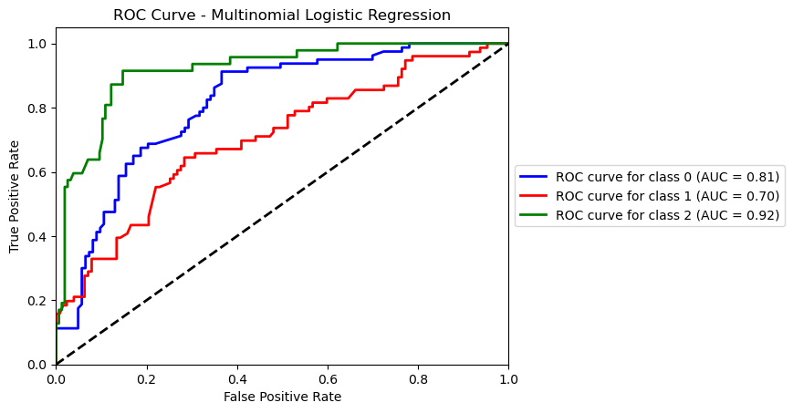

### Random Forest Classifier

- **Training**: Trained a Random Forest model with 100 estimators.
- **Feature Importance**: Found 'BS' (Blood Sugar) to be the most important feature, and 'HeartRate' the least significant.
- **Accuracy**: Achieved an accuracy of **81.28%**.
- **Confusion Matrix and ROC Curve**: Used to assess the model's predictive capabilities.

    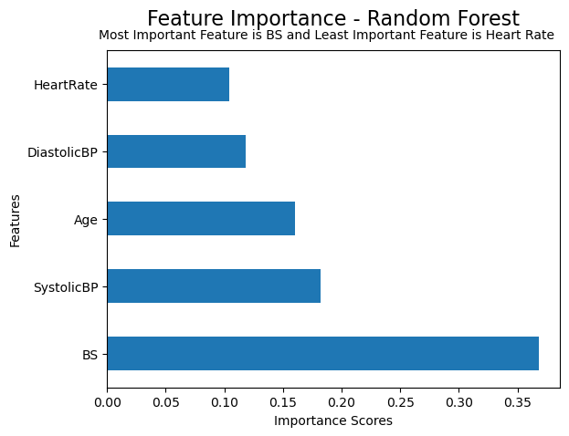
    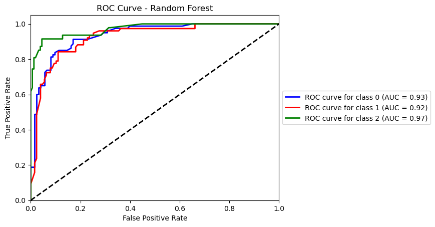

### XGBoost Classifier

- **Training**: Implemented an XGBoost classifier and tested with hyperparameter tuning using Grid Search CV.
- **Feature Importance**: Identified 'SystolicBP' as the most significant feature, with 'Age' being the least.
- **Accuracy**: Achieved the highest accuracy of **84.73%**.
- **Confusion Matrix and ROC Curve**: Showed improved performance over other models.

    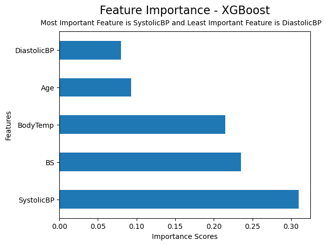
    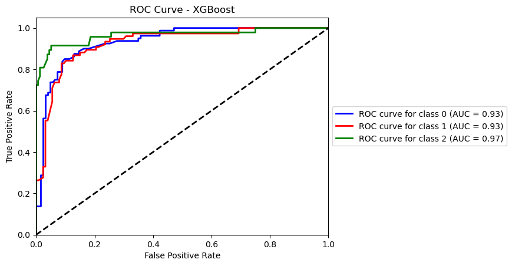

## Results

### Model Performance Comparison
| Model                 | Accuracy (%) | Precision | F1-Score |
|-----------------------|--------------|-----------|----------|
| **XGBoost**           | 0.847291        | 0.843251    | 0.842569   |
| **Random Forest**     | 0.812808        | 0.818523    | 0.813376   |
| **Logistic Regression** | 0.650246        | 0.659397    | 0.612030   |

- **XGBoost** outperformed the other models in all metrics.
- **ROC AUC Scores**:
  - **XGBoost**: Macro-Averaged AUC of **0.946**
  - **Random Forest**: Macro-Averaged AUC of **0.942**
  - **Logistic Regression**: Macro-Averaged AUC of **0.812**

### Confusion Matrices

- **XGBoost Confusion Matrix**
  
  

    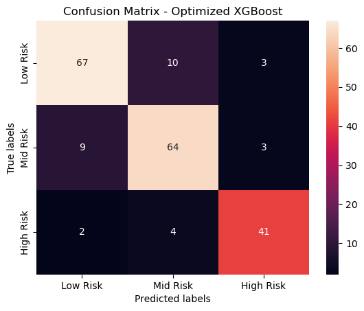
  

- **Random Forest Confusion Matrix**

  

    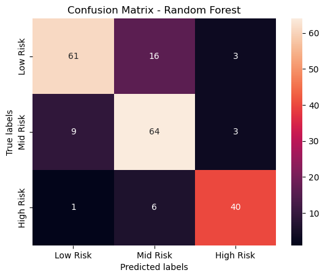
  

- **Logistic Regression Confusion Matrix**

  

    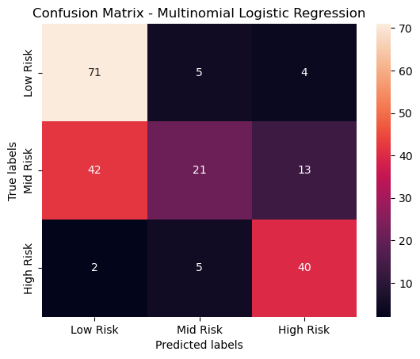
  

## Conclusion 

- **Feature Significance**: Blood Sugar ('BS') and Systolic Blood Pressure ('SystolicBP') are critical indicators of maternal health risk.
- **Model Selection**: The Optimized XGBoost Classifier provides the best performance and should be preferred for this task.
- **Healthcare Implications**: Implementing such predictive models can assist healthcare professionals in early identification of high-risk pregnancies, enabling timely interventions.

## Requirements

- **Programming Language**: Python 3.x
- **Libraries**:
  - numpy
  - pandas
  - scikit-learn
  - matplotlib
  - seaborn
  - xgboost
  - ucimlrepo

## References
- [UCI Machine Learning Repository: Maternal Health Risk Dataset](https://archive.ics.uci.edu/dataset/863/maternal+health+risk)
- [Scikit-learn Documentation](https://scikit-learn.org/stable/index.html#)
- [XGBoost Documentation](https://xgboost.readthedocs.io/en/stable/)